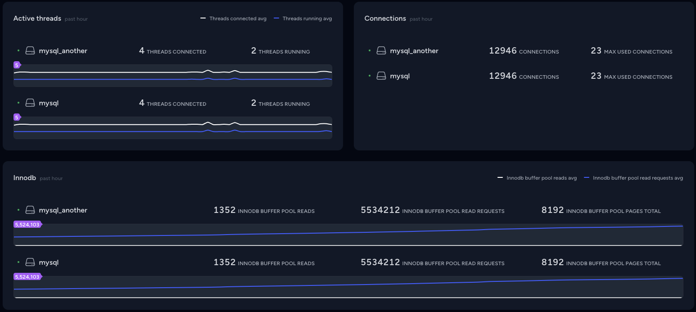

# Database status card for Laravel Pulse

Get real-time insights into the status of your database

## Example



## Installation

Install the package using Composer:

```shell
composer require maantje/pulse-database
```

## Register the recorder

In your `pulse.php` configuration file, register the DatabaseRecorder with the desired settings:

```php
return [
    // ...
    
    'recorders' => [
        \Maantje\Pulse\Database\Recorders\DatabaseRecorder::class => [
            'connections' => [
                'mysql_another' => [
                    'values' => [
                        'Connections',
                        'Threads_connected',
                        'Threads_running',
                        'Innodb_buffer_pool_reads',
                        'Innodb_buffer_pool_read_requests',
                        'Innodb_buffer_pool_pages_total',
                        'Max_used_connections'
                    ],
                    'aggregates' => [
                        'avg' => [
                            'Threads_connected',
                            'Threads_running',
                            'Innodb_buffer_pool_reads',
                            'Innodb_buffer_pool_read_requests',
                            'Innodb_buffer_pool_pages_total',
                        ],
                        'max' => [
                            //
                        ],
                        'count' => [
                            //
                        ],
                    ],
                ],
                'mysql' => [
                    'values' => [
                        'Connections',
                        'Threads_connected',
                        'Threads_running',
                        'Innodb_buffer_pool_reads',
                        'Innodb_buffer_pool_read_requests',
                        'Innodb_buffer_pool_pages_total',
                        'Max_used_connections'
                    ],
                    'aggregates' => [
                        'avg' => [
                            'Threads_connected',
                            'Threads_running',
                            'Innodb_buffer_pool_reads',
                            'Innodb_buffer_pool_read_requests',
                            'Innodb_buffer_pool_pages_total',
                        ],
                        'max' => [
                            //
                        ],
                        'count' => [
                            //
                        ],
                    ],
                ]
            ]
        ],
    ]
]
```

Ensure you're running [the `pulse:check` command](https://laravel.com/docs/10.x/pulse#capturing-entries).

## Add to your dashboard

Integrate the card into your Pulse dashboard by [publish the vendor view](https://laravel.com/docs/10.x/pulse#dashboard-customization).
and then modifying the `dashboard.blade.php` file:

```diff
<x-pulse>
    <livewire:pulse.servers cols="full" />
    
+   <livewire:database cols='6' title="Active threads" :values="['Threads_connected', 'Threads_running']" :graphs="[
+       'avg' => ['Threads_connected' => '#ffffff', 'Threads_running' => '#3c5dff'],
+   ]" />

+   <livewire:database cols='6' title="Connections" :values="['Connections', 'Max_used_connections']"  />

+   <livewire:database cols='full' title="Innodb" :values="['Innodb_buffer_pool_reads', 'Innodb_buffer_pool_read_requests', 'Innodb_buffer_pool_pages_total']" :graphs="[
+       'avg' => ['Innodb_buffer_pool_reads' => '#ffffff', 'Innodb_buffer_pool_read_requests' => '#3c5dff'],
+   ]" />

    <livewire:pulse.usage cols="4" rows="2" />

    <livewire:pulse.queues cols="4" />

    <livewire:pulse.cache cols="4" />

    <livewire:pulse.slow-queries cols="8" />

    <livewire:pulse.exceptions cols="6" />

    <livewire:pulse.slow-requests cols="6" />

    <livewire:pulse.slow-jobs cols="6" />

    <livewire:pulse.slow-outgoing-requests cols="6" />

</x-pulse>
```

And that's it! Enjoy enhanced visibility into your database status on your Pulse dashboard.
